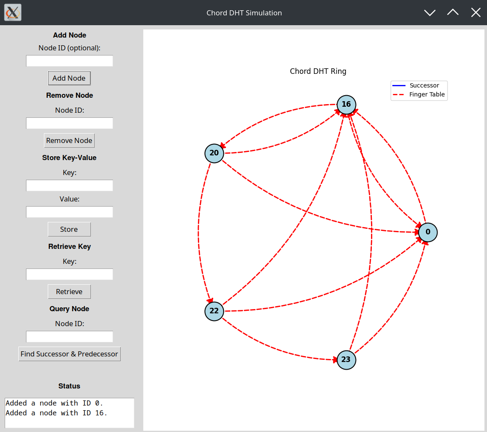
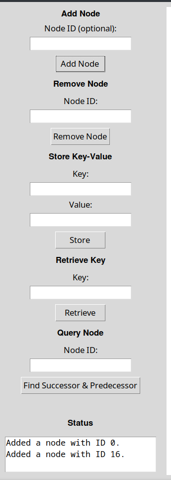
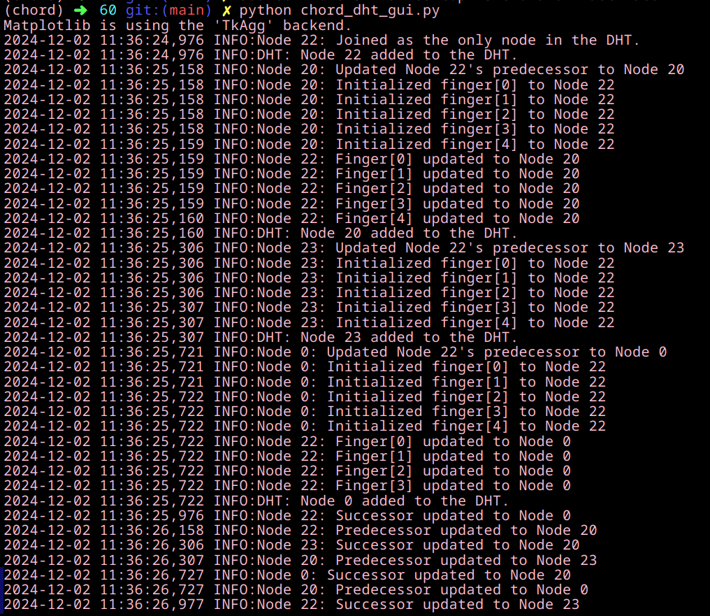

---

# Chord DHT Simulation with GUI

## Overview

This project implements a **Chord Distributed Hash Table (DHT)** protocol along with a Graphical User Interface (GUI) for simulation and visualization. It enables users to interact with the DHT by adding/removing nodes, storing and retrieving key-value pairs, and visualizing the dynamic structure of the DHT ring.

The Chord DHT protocol provides a scalable and efficient peer-to-peer network structure using **consistent hashing** and **finger tables** for quick lookups. The GUI further enhances usability by presenting the DHT ring structure and operations in a visual and interactive manner.

---

## Features

### Core Features
- **Chord Protocol Implementation**:
  - Consistent hashing for distributed key management.
  - Efficient lookup with \(O(\log N)\) complexity using finger tables.
  - Dynamic node addition and removal.
  - Replication for fault tolerance.

- **Interactive GUI**:
  - Add or remove nodes in the ring.
  - Store and retrieve key-value pairs.
  - Query nodes for successor and predecessor.
  - Real-time visualization of the DHT structure.

- **Visualization**:
  - Circular DHT ring with nodes and edges.
  - **Blue edges**: Successor links.
  - **Red dashed edges**: Finger table connections.

### Additional Features
- **Logging**:
  - Detailed logs for node operations, key storage, replication, and retrieval.
  - Logs are displayed in the terminal for debugging.

---

## Screenshots

| Feature                        | Description                                                  |
|--------------------------------|--------------------------------------------------------------|
|  | **Chord Ring Visualization**: Nodes and connections between them. |
|  | **Interactive GUI**: Controls for adding/removing nodes, storing, and retrieving keys. |
|  | **Logging Output**: Detailed logs of operations in the terminal. |
---

## Installation

### Prerequisites
- **Python 3.8+**
- Libraries:
  - `matplotlib`
  - `networkx`
  - `tkinter`
  - `numpy`

### Installation Steps
1. Clone the repository:
   ```bash
   git clone git@github.com:ss-369/Chord_DHT-Replication.git
   cd Chord_DHT-Replication
   ```

2. Install dependencies:
   ```bash
   pip install -r requirements.txt
   ```

   *(If `requirements.txt` is unavailable, manually install required libraries)*:
   ```bash
   pip install matplotlib networkx numpy
   ```

3. Run the application:
   ```bash
   python chord_dht_gui_fixed.py
   ```

---

## Usage

### GUI Controls
- **Add Node**:
  - Enter an optional node ID or let the system assign one automatically.
- **Remove Node**:
  - Remove a node by entering its ID.
- **Store Key-Value**:
  - Store a key-value pair in the DHT.
- **Retrieve Key**:
  - Retrieve a value associated with a key from the DHT.
- **Query Node**:
  - Find the successor and predecessor of a specific node.

### Visualization
- Nodes are displayed in a circular layout.
- **Blue Edges**: Represent successor relationships.
- **Red Dashed Edges**: Represent finger table connections.

---

## File Structure

```plaintext
Chord_DHT-Replication/
├── chord_dht_gui_fixed.py      # Main application with GUI
├── README.md                   # Documentation
├── requirements.txt            # Dependencies
├── screenshots/                # Images for README
│   ├── chord.png
│   ├── GUI.png
│   └── logging.png
└── assets/                     # Additional resources
```

---

## Key Concepts

### Chord Protocol
The Chord protocol enables scalable and efficient peer-to-peer communication:
- **Consistent Hashing**:
  - Nodes and keys are hashed to a fixed-size identifier space (e.g., \(0\) to \(2^M - 1\)).
- **Finger Tables**:
  - Each node maintains a routing table for efficient key lookups.
- **Successors and Predecessors**:
  - Ensure the ring structure remains intact during node joins and leaves.
- **Replication**:
  - Increases fault tolerance by duplicating data across multiple nodes.

### Replication Factor
The replication factor `R` determines how many nodes store a copy of a key-value pair. It is configurable for increased fault tolerance.

---

## Customization

### Modify Ring Size
Change the identifier space size by updating the `M` constant in the code:
```python
M = 5  # Number of bits (identifier range: 0 to 31)
```

### Configure Replication
Adjust the replication factor by modifying the `R` constant:
```python
R = 3  # Replication factor
```

### Logging Configuration
Enable file logging and customize log levels by modifying the logging setup:
```python
logging.basicConfig(
    level=logging.INFO,
    format='%(asctime)s %(levelname)s:%(message)s',
    handlers=[
        logging.FileHandler("chord_dht.log"),  # Save logs to a file
        logging.StreamHandler(sys.stdout)     # Print logs to console
    ]
)
```

---

## Future Enhancements
- Implement a **web-based interface** for remote access.
- Extend visualization to show **data replication** and storage distribution.
- Introduce failure recovery mechanisms for nodes.

---

## Contributing

### Steps to Contribute
1. Fork the repository.
2. Create a feature branch:
   ```bash
   git checkout -b feature-name
   ```
3. Commit your changes:
   ```bash
   git commit -m "Description of changes"
   ```
4. Push your changes:
   ```bash
   git push origin feature-name
   ```
5. Open a pull request.

---


## Acknowledgments
This implementation is inspired by the [Chord DHT protocol paper](https://pdos.csail.mit.edu/papers/chord:sigcomm01/chord_sigcomm.pdf) and aims to provide an educational tool for understanding its principles.

---

### Instructions to Push Changes

1. Add all files and updated README to Git:
   ```bash
   git add .
   ```

2. Commit changes with a descriptive message:
   ```bash
   git commit -m "Updated README with screenshots and features"
   ```

3. Push to the `main` branch:
   ```bash
   git push origin main
   ```

